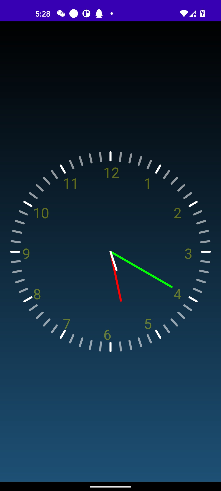

# androidDevelop

## chapter 2 : leetcode app

## chapter 3 : animation

## chapter 4 : clock

## chapter 5 : translator

## chapter 6: todo list
* 为Todo List的场景建立一个数据库，完成数据库表的设计和创建
* 进入主页后，以列表的形式展现出数据库中所有的数据
* 点击“+”后，跳转到一个新页面，输入任意类容，把类容插入数据库，返回主页并更新UI
* 点击任意一条checkbox可以把该条note设置为已完成，并更新数据库及UI
* 点击任意一个“x”，可以删除该条note，并更新数据库及UI

## chapter 7 

+ 网络图片展示（动图+静图）
+ 支持左右滑动切换显示不同图片   
+ 网络视频播放、暂停、重播功能
+ 进度条展示，点击移动到制定位置

## chapter 8

+ 完成基本相机功能

+ 支持拍照和摄影

  